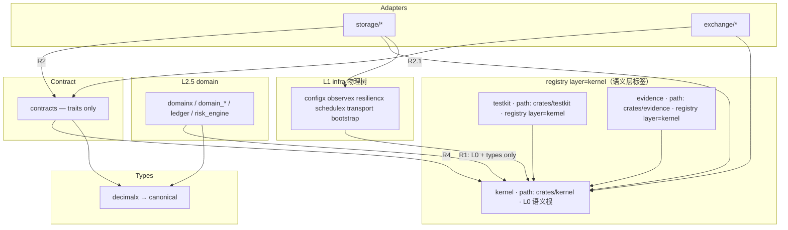
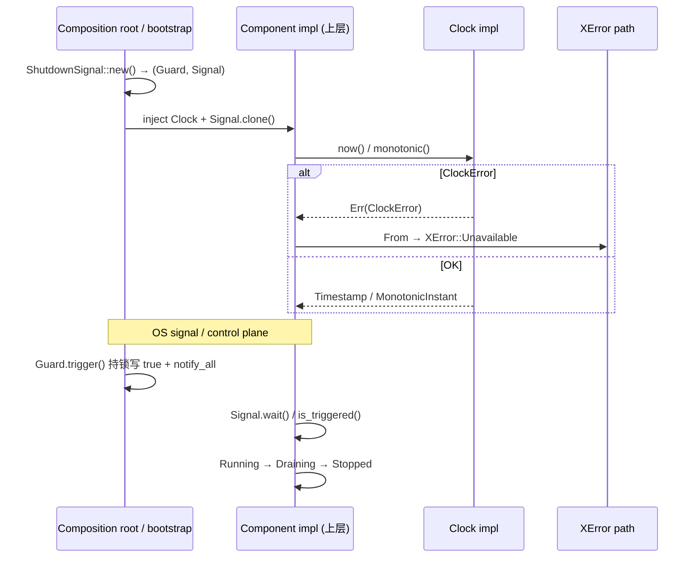
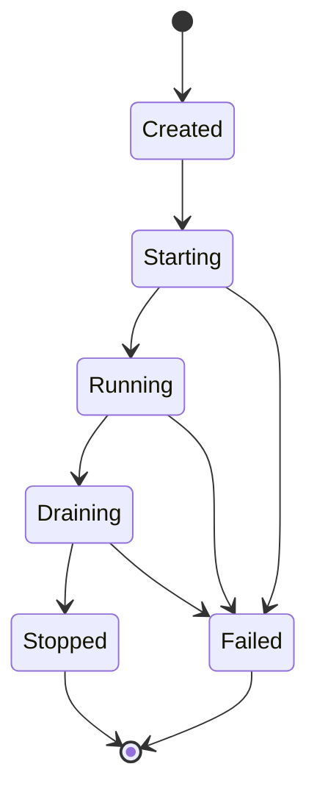
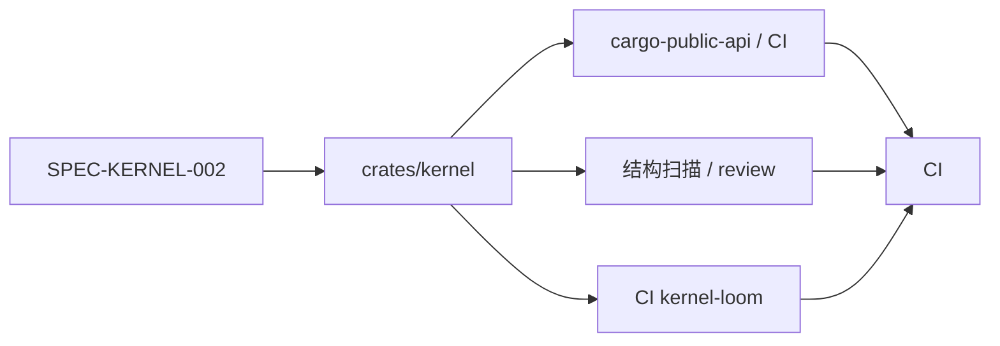

> **历史基线（2026-07-14，非当前权威）**：本文件保留 `xhyper-kernel 0.1.1` 发布战役事实，不描述当前 `kernel 0.3.1` 候选。当前设计以 [design.md](design.md) 为准，验收入口见 [../README.md](../README.md)。

# DESIGN-KERNEL-002 · L0 Kernel Runtime Semantics

| 字段 | 值 |
|------|-----|
| Design ID | `DESIGN-KERNEL-002` |
| Source Spec | `SPEC-KERNEL-002`（`.agents/ssot/kernel/spec/spec.md`） |
| Supersedes | 过薄清单 design（PR-1 已替换） |
| Package / lib | `xhyper-kernel` / `kernel` @ `crates/kernel` |
| Version | **0.1.1**（已 merge main · 已 tag `kernel-v0.1.1` · 已 publish crates.io） |
| Layer | L0 / Kernel |
| Registry / distribution | **`stable`** / `publish = true`；0.1.1 已发布 |
| Spec Status | **Approved** |
| Ship baseline | PR [#235](https://github.com/xhyperium/infra.rs/pull/235) · **MERGED** 2026-07-14 · merge `e7bda98e` · tag `kernel-v0.1.1` · head `feat/kernel-002-e2-migrate-banned-apis` · base `main` · 实际标题见 PR Plan PR-0 |
| Current task SSOT | Beads `xhyper-g09` |
| Production certification | **NOT CLAIMED** |
| Author | platform / AI design pass |
| Date | 2026-07-14 |
| Status | **Active design**；发布历史不等于当前生产认证 |

## 文档 SSOT 过渡

| 阶段 | 权威 |
|------|------|
| **当前（PR-1 已落仓）** | 本文件 = **Active 长文** `DESIGN-KERNEL-002`；薄清单废止 |
| 实现细节冲突时 | 永远：`spec.md` 规范合同 → 本设计 → **源码 + 测试** 为最终实现 SSOT |
| main 合入 | **已完成**（PR #235 merge `e7bda98e`，2026-07-14）；已 tag `kernel-v0.1.1`；已 publish crates.io |

**SSOT 分层（Issue 13）**：`spec.md` 规定必须实现什么；本设计解释为何、边界与机控真实力度；`crates/kernel` 源码与 `tests/*` 是可执行真相。绿地重建必须对照 spec §5–7 与测试文件，不可仅凭本文重写 Display 格式串等细节。

---

> ## Post-ship status (2026-07-14 · live)
>
> | 项 | 状态 |
> |----|------|
> | PR #235 | **MERGED** → main |
> | Tag / GH Release | `kernel-v0.1.1` |
> | crates.io | **`xhyper-kernel` 0.1.1** published |
> | 机控 | **infra.rs**：结构扫描 / tests / CI；**archgate OOS**（历史 monorepo 曾 16/16 KERNEL-*） |
> | mutants / branch / miri | **实测 PASS**（mutants missed=0） |
> | residual OPEN | **0** |
> | package | name **`xhyper-kernel`** · lib **`kernel`** · `publish = true` |
>
> 下文若出现「OPEN / DEFER / publish=false / 14 规则」等**战役中途**措辞，以本表 + `gate.md` + `residual-open.txt` 为准。

## Overview

`kernel` 是 infra.rs workspace 的 **L0 语义信任根**。它不提供业务能力、不承担 DI / IO / 观测 / 网络 / async runtime，只冻结全系统被迫共享的三类语义：

1. **error** — 错误如何按「调用方应如何反应」分类与传播（opaque `XError` + `ErrorKind` ×9 + `XResult`）
2. **clock** — 墙钟与单调钟如何获取、表示与比较（`Timestamp` / `MonotonicInstant` / `Clock` / `SystemClock`）
3. **lifecycle** — 组件状态共同语言与关停原语（`ComponentState` / `ShutdownSignal`·`ShutdownGuard`；**无** `Component` trait）

**SPEC-KERNEL-002** 主路径已 **merge 进 main**（PR #235，merge `e7bda98e`，2026-07-14），已 tag `kernel-v0.1.1`，已 publish crates.io `xhyper-kernel` 0.1.1。落地事实包括：KERNEL-* 设计意图闭合（历史 monorepo 曾以 archgate 16/16 机控；**infra.rs 不适用（OOS）**，本仓机控 = 结构扫描 / unit tests / CI（coverage, loom, miri, public-api））、public-api 纪律、registry `stable`、version `0.1.1`、residual OPEN=0（branch/miri/mutants **ad-hoc 实测 PASS**；CI 门禁化见 P1）。

**术语纪律（全文适用）**：

| 用语 | 含义 |
|------|------|
| **已 merge 进 main / land** | PR #235 对 main 的 merge 完成（**已完成**，2026-07-14，`e7bda98e`） |
| **已 ship / 可 tag** | main 含 0.1.1 + stable + 已 tag `kernel-v0.1.1` + 已 publish crates.io |

---

## Background & Motivation

### 问题陈述

在量化交易 / 行情基础设施 monorepo 中，若错误分类、时间源与关停协议在各 crate 各自演化，会出现：

| 失真类别 | 典型症状 | 系统代价 |
|----------|----------|----------|
| 错误反应分裂 | 同一网络抖动有的重试有的 fail-fast；`not_found` 映射为 `Invalid` 制造语义谎言 | 错误预算失真、重试风暴或静默吞错 |
| 时间失真 | 直接 `SystemTime::now` / 默认 `monotonic` 用真实 `Instant`；反向差饱和为 0 | 测不准 latency、回测/实盘时钟语义不一致 |
| 关停失控 | `AtomicBool` + `notify_all` 无同 mutex；`sleep` 当正确性证明；过早 `Component` trait | lost wake-up、假绿 CI、L0 被 composition 污染 |

SPEC-KERNEL-001 时代的 `xlib_standard` 已暴露：enum 可匹配 `XError` 变体、`not_found`/`other` 垃圾桶、`Clock::monotonic` 默认实现、`Component` 无生产实现、公开 mock feature 等。SPEC-KERNEL-002 以 **准入四问** 收紧边界，并完成迁移；PR #235 已 merge 进 main（`e7bda98e`，2026-07-14），详见 PR Plan **Land track**（PR-0b 已完成）。

### 当前状态（已 merge main · 已 publish crates.io）

| 面 | 落地事实 | 证据位置 |
|----|----------|----------|
| 源码 | `src/{lib,error,clock,lifecycle}.rs` 三模块 + 根 re-export | `crates/kernel/src/` |
| Cargo | `publish=true`（包名 `xhyper-kernel`）；`[lib] name="kernel"`；`default=[]`；生产依赖仅 `thiserror`；`cfg(loom)` 条件依赖 | `crates/kernel/Cargo.toml` |
| 属性 | `#![forbid(unsafe_code)]` + `deny(missing_docs, unreachable_pub)` | `lib.rs` |
| 门禁 | KERNEL-* 设计意图；API regenerate/diff 纪律；Cargo metadata；publish 一致 | 历史：`tools/archgate`（**OOS**）；本仓：tests / CI / public-api / 结构扫描 |
| 测试 | unit / integration / proptest / loom 资产 + CI `kernel-loom`；line cov **~98.95%**；branch/mutants/miri ad-hoc 实测 PASS（CI 门禁待补 P1） | `tests/*` + `evidence/2026-07-14/` |
| PR | **#235 MERGED** → main（`e7bda98e`）；tag `kernel-v0.1.1`；crates.io published | `gh pr view 235` |
| 状态 | Approved / stable / published；production certification **NOT CLAIMED** | current gate + commit-bound Evidence |

### 痛点（战役前）

- 信任根 API 可被字符串匹配与变体匹配绕过
- 时间默认实现让「假时钟」无法注入完整语义
- 关停协议未经 loom，sleep 冒充正确性
- design 文档仅 checklist，无法支撑下游 review 与演进边界判断

---

## Goals & Non-Goals

### Goals

1. **唯一语义**：error / clock / lifecycle 在 workspace 内只有一种权威定义。
2. **最小公开面**：冻结 `lib.rs` 导出集；任何新增公开项走 RFC + 更新 candidate snapshot；KERNEL-API-001 用固定版本 `cargo-public-api` 从当前源码 regenerate 后与 snapshot 比较，不一致 fail closed。
3. **零 workspace 生产依赖**：`kernel → ∅`（内部）；外部生产白名单仅 `thiserror`。
4. **可注入时间**：`Clock` 无全局单例；`monotonic` 无 trait 默认；testkit `ManualClock` 独立墙钟/单调通道。
5. **可证明关停**：`Mutex<bool>+Condvar` 持锁 `notify_all`；loom 模型测试 + CI job `kernel-loom` 执行。
6. **机器强制（诚实边界）**：KERNEL-* 设计意图（含 API-002 + TIME-004 语义）；**archgate 机控 infra.rs 不适用（OOS）**；本仓机控 = 结构扫描 / unit tests / CI（coverage, loom, miri, public-api）；**不**把窄扫描写成全覆盖。
7. **诚实证据**：branch/mutants/miri 已 ad-hoc 实测 PASS（artifact 见 evidence/2026-07-14/），CI 门禁化见 P1 follow-up；**不**把 ad-hoc 实测粉饰为 CI 已门禁。

### Non-Goals（永久或本版本明确不做）

```text
- 配置 / 环境变量 / 文件系统
- 日志 / 指标 / 追踪 / OpenTelemetry
- 网络 / 数据库 / MQ / 序列化协议
- tokio / async-std / 任何 runtime 耦合
- DI、Service Locator、插件注册
- 健康检查、重试、熔断、限流、调度
- 领域 ID / 订单 / 持仓 / 行情 / 资金
- serde wire / JSON / 人类时间格式
- 全局 Clock 单例
- test mock / fixture（归属 testkit）
- Component trait（§7.8；无 ≥2 生产实现前禁止）
- 为兼容遗留而长期保留的语义别名（not_found / other / context_cow 等已删）
```

### 准入四问（进入 kernel 的充分必要条件）

一个能力必须 **同时** 满足：

```text
1. 全系统必须只有一种语义；
2. 两种并存会导致错误响应、时间失真或关停失控；
3. 不属于任何单一业务、领域、适配器或基础设施能力；
4. 语义预计以年为单位保持稳定。
```

不满足任一项 → 放到 `types/*`、`contracts`、`infra/*`、adapters、domain、`testkit`、apps 或 tools。

---

## Implemented Design

### 分层位置与依赖（R1–R6）

权威：`docs/architecture/spec.md` §2 / §4.1。



**双轴说明（layer 标签 vs 物理目录）**：

- registry `layer = "kernel"` 表示 **语义归属 L0 信任带**，不是「与 `kernel` 同 crate」。
- `evidence` 物理在 `crates/evidence`；current-state spec 位于 `.agents/ssot/evidence/`；`testkit` 在 `crates/testkit`。上图边均为 **依赖 kernel**，无反向箭头。
- 注：历史 `crates/gate` 已退役；历史 monorepo 机器门禁曾由 `tools/archgate` 承载。**infra.rs 不适用（OOS）**：本仓不移植 archgate，不维护 `.architecture/**`；机控走结构扫描 / tests / CI。

| 规则 | 对 kernel 的含义 |
|------|------------------|
| R1 / R1.1 | L2.5 可直接依赖 `kernel`，**禁止** contracts/L1/适配器 |
| R2 / R2.1 | 适配器依赖白名单含 `kernel`；适配器互不依赖 |
| R3 / R3.1 | L1 互不依赖，但各自可依赖 `kernel`；仅 bootstrap 组装全局 |
| R4 | contracts 仅可依赖 `kernel` + canonical + 最小三方库 |
| R6 | 跨层走 contracts trait；kernel 类型是共享 DTO/语义，非适配器实现重导出 |
| **kernel 自身** | **禁止** 依赖任何 workspace crate（含 contracts/testkit） |

```toml
# crates/kernel/Cargo.toml（事实）
[package]
name = "kernel"
version = "0.1.1"
publish = true

[lib]
name = "kernel"

[features]
default = []

[dependencies]
thiserror = { workspace = true }

[target.'cfg(loom)'.dependencies]
loom = "0.7"

[dev-dependencies]
proptest = "1"
static_assertions = "1"
```

### 模块结构

```text
crates/kernel/
├── Cargo.toml
├── README.md / AGENTS.md / CHANGELOG.md
├── src/
│   ├── lib.rs          # 三模块 + 冻结 re-export；crate 属性
│   ├── error.rs        # XError / ErrorKind / XResult
│   ├── clock.rs        # Timestamp / MonotonicInstant / Clock / SystemClock
│   └── lifecycle.rs    # ComponentState / ShutdownSignal|Guard
└── tests/
    ├── public_api.rs
    ├── api_compile.rs          # static_assertions + rustdoc compile_fail
    ├── clock_contract.rs       # proptest + 合同
    ├── lifecycle_concurrency.rs
    └── lifecycle_concurrency_loom.rs
```

禁止新增 `util.rs` / `common.rs` / `prelude.rs` / `helpers.rs` 等收容型模块。

### 总架构：三类语义协作



---

### 1. error — 反应分类错误系统

#### 接口形状（与源码一致）

```rust
// crates/kernel/src/error.rs
pub type BoxError = Box<dyn Error + Send + Sync + 'static>;
pub type XResult<T> = Result<T, XError>;

#[non_exhaustive]
pub enum ErrorKind {
    Invalid, Missing, Conflict, Transient, Unavailable,
    Cancelled, DeadlineExceeded, Invariant, Internal,
}

// opaque — 字段私有
pub struct XError {
    kind: ErrorKind,
    context: Cow<'static, str>,
    retry_after: Option<Duration>,
    source: Option<BoxError>,
}
```

公开构造器（每 kind 一个；`Transient` 另有 `transient_after`）：

| 构造器 | ErrorKind | 反应摘要 |
|--------|-----------|----------|
| `invalid` | Invalid | 不自动重试；修正输入后重提 |
| `missing` | Missing | 不立即自动重试；可 fallback |
| `conflict` | Conflict | 状态变化前重试无意义 |
| `transient` / `transient_after` | Transient | **唯一** `is_retryable()==true` |
| `unavailable` | Unavailable | 依赖/能力不可用；≠ Transient |
| `cancelled` | Cancelled | 正常终止路径；不记内部故障 |
| `deadline_exceeded` | DeadlineExceeded | 本次终止；是否重试由上层决定 |
| `invariant` | Invariant | **唯一** `is_bug()==true`；bug |
| `internal` | Internal | 棘轮只减不增；须带迁移计划 |

查询 / 链式：

- `kind()` / `context()` / `retry_after()`
- `with_source(impl Into<BoxError>)` — **保持 kind 不变**
- `is_retryable()` / `is_bug()`
- `Display`：固定 kind 前缀 + context；**不含** source 细节
- `From<ClockError>` → 一律 `Unavailable` + source 链

#### 不变量

1. `XError` 不可解构匹配字段；不可 `Clone`；自定义 Debug 与 Display 均不格式化 source。
2. 禁止 `From<String>` / `From<&str>` / `From<anyhow::Error>`。
3. 禁止 `not_found` / `other` / `context_cow` / `internal_msg`（已删除）。
4. `ErrorKind` / 构造器集合冻结；无通用 `into_xerror` 构造旁路；新增 kind 须 RFC + 全下游迁移。
5. `XError::internal` 业务侧调用点 ≤ `XERROR_INTERNAL_BASELINE`（当前 **8**；KERNEL-ERR-001 **设计意图**；历史 monorepo archgate 机控 · **infra.rs OOS**，本仓结构扫描 / review）。
6. **规范（应）**：反应决策基于 `kind()`，禁止用 `Display`/任意字符串匹配决定重试或分类。  
   **历史机控边界（是）**：KERNEL-ERR-002 曾仅扫 **legacy 窄模式**——同行内同时出现 `ErrorKind::`/`XError::` 与 `"not_found"` / `"not found"` / `"other"` / `contains("not_found")` 等 residual 字符串；**不**拦截 `err.to_string().contains("transient")`、自定义 Display 匹配等。完整禁令依赖 code review；**archgate 本仓 OOS**。

#### 失败模式

| 场景 | 行为 |
|------|------|
| 分类错误使用 | 逻辑错误（误重试 / 误 bug 告警）；由 code review + 棘轮约束 |
| Clock 失败 | `Unavailable`，禁止哨兵 0 时间 |
| source 附加 | kind 不变；Display 仍只显示 context |
| 敏感数据 | context 不得写入密钥/完整订单；Display/Debug 面向人类非 wire |

#### 当前实现备注（诚实）

- `context` 字段类型为 `Cow<'static, str>`，但构造路径经 `impl Into<String>` → **恒 `Cow::Owned`**（RES-PERF-001 **DEFER**）：未来若加 `Cow::Borrowed` 路径须 additive 双 API 或人审半破坏签名，禁止 silently 改 `Into<String>` 语义。

---

### 2. clock — 墙钟与单调钟分离

#### 接口形状

```rust
// crates/kernel/src/clock.rs
pub struct Timestamp(i64); // Unix epoch nanos；无 Default

impl Timestamp {
    pub const fn from_unix_nanos(nanos: i64) -> Self;
    pub const fn as_unix_nanos(self) -> i64;
    pub fn checked_add(self, d: Duration) -> Option<Timestamp>;
    pub fn checked_sub(self, d: Duration) -> Option<Timestamp>;
    pub fn checked_duration_since(self, earlier: Timestamp) -> Option<Duration>;
}

pub struct MonotonicInstant { nanos: u128 } // origin 起流逝；不可序列化

impl MonotonicInstant {
    #[doc(hidden)]
    pub const fn from_clock_elapsed(elapsed: Duration) -> Self;
    pub fn checked_duration_since(self, earlier: Self) -> Option<Duration>;
}

pub trait Clock: Send + Sync {
    fn now(&self) -> Result<Timestamp, ClockError>;
    fn monotonic(&self) -> MonotonicInstant; // 无默认实现
}

pub struct SystemClock { origin: Instant } // !Copy；Clone/Default

#[non_exhaustive]
pub enum ClockError {
    BeforeUnixEpoch,
    Overflow,
    Unavailable, // 预留；SystemClock 当前不产生
}
```

#### `SystemClock` 实现合同

```text
now():
  SystemTime::now()
  → duration_since(UNIX_EPOCH)  // Err → BeforeUnixEpoch
  → i64::try_from(nanos)        // Err → Overflow
  → Timestamp::from_unix_nanos

monotonic():
  self.origin.elapsed()
  → MonotonicInstant::from_clock_elapsed(...)
```

**不变量：**

1. 墙钟失败 **显式 `Err`**，禁止返回 0 或静默默认。
2. `Timestamp` / `MonotonicInstant` **无 `Default`**（`api_compile` 编译期断言）。
3. Timestamp 使用 i128 中间值覆盖完整 i64 域；反向 `checked_duration_since` → **`None`**，禁止饱和 `Duration::ZERO`。
4. 墙钟允许因 NTP/人工校时回退；间隔与 deadline 必须使用单调钟。`Clock::monotonic` **无 trait 默认**。
5. **墙钟/单调 now 的边界（设计意图；历史 monorepo 曾 archgate 机控）**：
   - **KERNEL-TIME-001**：在 **非** `crates/kernel/` 的生产 `.rs` 中禁止 `SystemTime::now` **与** `Utc::now`；历史扫描排除整个 `tools/` 前缀。
   - **KERNEL-TIME-002**：`Instant::now` 仅允许路径前缀 `crates/kernel/`（**整个 kernel 树**，不限于 `SystemClock` 函数体字面）。
   - **规范意图**仍是：业务生产路径应只经 `Clock`/`SystemClock` 取时。
   - **infra.rs 不适用（OOS）**：本仓不跑 archgate；边界靠结构扫描 / review，非 archgate 验收。
6. **构造入口分轨（勿混）**：
   - **KERNEL-TIME-003**：**只**允许 `from_unix_nanos` 调用点在既定 allowlist（历史 `FROM_UNIX_NANOS_ALLOW`）：  
     `crates/kernel/`、`crates/testkit/`、  
     `crates/domain/macro/`、`crates/evidence/src/`、`crates/adapters/evidence/`，  
     `crates/adapters/exchange/binance/src/rest.rs`、  
     `crates/adapters/exchange/okx/src/rest.rs`  
     （后几者为同文件 `#[cfg(test)]` FixedClock 字面墙钟 / 持久化还原墙钟）。
   - **KERNEL-TIME-004**：`from_clock_elapsed` 调用位置限制（历史 `FROM_CLOCK_ELAPSED_ALLOW`）。设计意图保留；**archgate 机控 OOS**，本仓靠 `#[doc(hidden)]` + 结构扫描 / review。
7. `SystemClock` 非 `Copy`（持有 origin）；每次 `new()` 固定 origin，**禁止**每次 monotonic 重建 origin。
8. 无 serde、无人类时间 `Display`、无 `From<SystemTime>`、无 `from_nanos`/`as_nanos` 简写别名。

#### 测试替身（不在 kernel）

`testkit::ManualClock`：

- `set` / `advance` 控制墙钟
- `advance_mono` 独立控制单调钟
- 实现 `Clock`，经 `from_clock_elapsed` 构造 mono

#### 失败模式

| 失败 | 返回 | 下游映射 |
|------|------|----------|
| 系统时间 < epoch | `ClockError::BeforeUnixEpoch` | `XError::Unavailable` |
| nanos > i64 | `ClockError::Overflow` | `XError::Unavailable` |
| 时间源不可用（预留） | `ClockError::Unavailable` | 同上 |
| 时间算术溢出 / 反向差 | `Option::None` | 调用方处理，不 panic |

#### 正确性 vs smoke

- **正确性**：`checked_*` 单元/proptest、非 sleep 序列采样（32 samples non-decreasing）、loom 无关
- **interval smoke only**：`SystemClock` 真实 sleep 测推进 — 标注 *not correctness proof*（RES-DOWN-006）

---

### 3. lifecycle — 状态共同语言 + 关停原语

#### `ComponentState` 状态机



- `can_transition_to` / `try_transition` — 非法 → `LifecycleError { from, to }`，**不 panic**
- `#[non_exhaustive]` — 禁止下游假定穷尽匹配后无新变体
- **不**提供编排、健康检查、重启

#### `ShutdownSignal` / `ShutdownGuard`

```text
协议（SPEC §7.6）：
  inner: Arc< Mutex<bool> + Condvar >

trigger(self):          // 消费 Guard，不可逆
  lock → *flag = true → notify_all → unlock

wait(&self):
  lock → while !flag { cv.wait } → unlock

is_triggered(&self):
  lock → *flag（poison → into_inner）

drop(Guard):
  不 trigger、不 panic、不记日志
```

| 属性 | Signal | Guard |
|------|--------|-------|
| Clone | ✅ 多方观察 | ❌（`assert_not_impl_any`） |
| must_use | ✅ | ✅ |
| 触发 | 观察 | `trigger(self)` 消费 |

**锁中毒（§10.2）**：`unwrap_or_else(|p| p.into_inner())` — 恢复后继续同一状态机，不返回伪造成功「未触发」。

#### 为何无 `Component` trait（§7.8）

1. 尚无 ≥2 真实生产实现证明同步抽象稳定  
2. start/stop/drain 常涉 async、deadline、领域副作用  
3. 过早冻结会把 composition 错误下沉到 L0  

未来 RFC 前置：两独立生产组件 + 同步语义可统一 + 无 runtime 类型 + 不承担依赖排序。

#### 失败模式

| 场景 | 行为 |
|------|------|
| 非法状态转换 | `Err(LifecycleError)` |
| lost wake-up（错误实现） | **禁止**；本实现持锁 notify；loom 覆盖 |
| Guard 被 drop | 不关停；bootstrap 须保证 owner |
| 重复 wait | 已触发立即返回（幂等观察） |
| 锁中毒 | into_inner 恢复；T-TEST-001 单测 |

---

## API / Interface Changes

### 冻结公开导出（§8）

```rust
// crates/kernel/src/lib.rs
pub mod clock;
pub mod error;
pub mod lifecycle;

pub use clock::{Clock, ClockError, MonotonicInstant, SystemClock, Timestamp};
pub use error::{BoxError, ErrorKind, XError, XResult};
pub use lifecycle::{ComponentState, LifecycleError, ShutdownGuard, ShutdownSignal};
```

公开 API 纪律：应用固定版本 `cargo-public-api` 从当前 `xhyper-kernel` 源码 regenerate 并 diff（`KERNEL-API-001` 语义）。  
> **infra.rs 不适用（OOS）**：本仓**不**维护 `.architecture/api/kernel-public-api.txt`；以 public-api / CI / 审查为准，不走 archgate。

### 相对 SPEC-KERNEL-001 / 旧实现的破坏性迁移（已完成）

| 旧 API / 行为 | 新合同 | 战役 |
|---------------|--------|------|
| `XError` enum 可匹配变体 | opaque struct + `kind()` | E3 |
| `not_found` / `other` | 删除；用 `missing` / 明确 kind | E2/E3 |
| `internal_msg` / 双参 internal | `internal(context)` + `with_source` | E3 |
| `context_cow` | 删除；下游用 `context()` | RES-ERR-010 |
| `Clock::monotonic` 默认 `Instant::now` | 无默认；各 impl 显式 | C1 |
| `from_nanos` / `as_nanos` 别名 | 仅 `from_unix_nanos` / `as_unix_nanos` | C2 |
| mono reverse → 0 | → `None` | C2 |
| `SystemClock` 无 origin / Copy | `{ origin }`，!Copy | C1 |
| `AtomicBool` + Condvar | `Mutex<bool>+Condvar` 持锁 notify | L1 |
| 公开 `Component` trait | 移除 | L2 |
| kernel `mock` feature + ManualClock | 迁 `testkit`；`default=[]` | G / Cargo |
| `publish` 未显式 | `publish=true`（crates.io `xhyper-kernel`） | G |

### 下游约束（feature 分支合同；**merge 进 main 后对全仓库强制**）

1. 不得新增 `XError::internal` 调用点使总数 > baseline 8（须审批降其他点或改分类）——KERNEL-ERR-001 设计意图；本仓结构扫描 / review（archgate **OOS**）。
2. **规范**：反应断言用 `kind()`，禁止 match `Display` 字符串。**历史机控**：ERR-002 legacy `not_found`/`other` 窄扫描；其余靠 review。
3. 自定义 `Clock` 必须实现 `monotonic`。
4. 生产路径避免直调 `SystemTime::now` / `Utc::now` / `Instant::now`（TIME-001/002 设计意图，边界见上；历史 monorepo `tools/` 豁免；**archgate 机控 OOS**）。
5. 关停正确性不以 sleep 证明；composition 须显式持有 `ShutdownGuard` 并在 OS signal 路径 `trigger`。
6. 公开 API 变更 = 全 workspace 影响；破坏性须 RFC + 迁移批次 + Evidence + public-api diff。KERNEL-API-001/002 为 **设计意图**（regenerate/diff；baseline 拒 removal；addition 须 Approved RFC）。**本仓不维护 `.architecture/**`，不要求 `cargo run -p archgate`。**

---

## Data Model Changes

kernel **不定义 wire / DB schema**。需要传输时由 `types/canonical` 或协议层版本化，例如：

```rust
// 示意：不在 kernel 内
pub struct TimestampWireV1 { pub unix_nanos: i64 }
// From/TryFrom 与 kernel::Timestamp 显式转换
```

`ErrorKind` / `ComponentState` 同理：协议层版本化 enum，**禁止**对 kernel 类型直接 `Serialize`。

无迁移脚本：纯进程内语义类型；破坏性靠源码迁移 + API 快照 diff。

---

## 公开 API 冻结策略与机控边界

> **infra.rs 不适用（OOS）**：历史 monorepo 以 `archgate` + `.architecture/**` 做 KERNEL-* 机控；**本仓明确不移植 archgate**，不维护 `.architecture/**`。本仓机控 = 结构扫描 / unit tests / CI（coverage, loom, miri, public-api）。下列规则表保留为 **设计意图** 与战役审计参考。

### 控制面（infra.rs）



历史 monorepo 另有 `archgate KERNEL-*` + `.architecture/api/*` 边 → **OOS**。

### 命名规则一览（设计意图；历史实装曾在 `tools/archgate`）

| Rule ID | 设计意图 | 本仓处置 |
|---------|----------|----------|
| KERNEL-DEP-001 | `[dependencies]` 中 workspace 包名 = 0 | Cargo + 结构扫描 / review |
| KERNEL-DEP-002 | 外部生产依赖仅 `thiserror` | Cargo + review |
| KERNEL-FEATURE-001 | features 仅 `default` 且空，或无 features 节 | Cargo + review |
| KERNEL-API-001 | 固定版本 `cargo-public-api` regenerate 后与快照比较；禁 Component/serde 面 | public-api / CI；**非 archgate** |
| KERNEL-API-002 | 相对冻结 baseline：removal/signature change 拒绝；addition 须 Approved RFC | 纪律 + review；历史 archgate 机控 **OOS** |
| KERNEL-PUBLISH-001 | Cargo 与 Spec `publish` 一致（历史含 registry 三方） | Cargo + Spec；本仓不维护 registry 文件 |
| KERNEL-TIME-001 | 非 kernel：禁 `SystemTime::now` **与** `Utc::now` | 结构扫描 / review |
| KERNEL-TIME-002 | `Instant::now` 仅 `crates/kernel/` 前缀 | 结构扫描 / review |
| KERNEL-TIME-003 | `from_unix_nanos` 仅 allowlist 路径 | 结构扫描 / review |
| KERNEL-TIME-004 | `from_clock_elapsed` 调用位置 allowlist | `#[doc(hidden)]` + 扫描 / review |
| KERNEL-ERR-001 | 消费侧 `XError::internal` 计数有基线 | 结构扫描 / review |
| KERNEL-ERR-002 | **窄** residual：禁 not_found/other 字面分类 | 扫描 / review（非全 Display 禁令） |
| KERNEL-SERDE-001 | kernel src 无 serde 相关 token | 源码 + review |
| KERNEL-ASYNC-001 | kernel src 无 tokio/async-std token | 源码 + review |
| KERNEL-UNSAFE-001 | kernel unsafe **用法** = 0 | `#![forbid(unsafe_code)]` |
| KERNEL-LIFECYCLE-001 | loom 资产存在；**执行**靠 CI | tests + CI `kernel-loom` |

**诚实边界**：ERR-002 为窄 residual 扫描意图、LIFECYCLE-001 的动态正确性靠 CI loom，勿高估机控覆盖。

### 变更流程（公开面 · infra.rs）

```text
1. 写/更新 Spec 或 kernel RFC（触及公开 API）
2. 状态 Approved
3. 改 crates/kernel + 下游同一批次
4. cargo public-api -p kernel --simplified（固定版本）→ 规范化后纳入 PR diff / CI
5. addition 相对 baseline 须 Approved RFC；removal/signature change 禁止
6. cargo test -p xhyper-kernel（及 clippy/fmt）；**不**要求 cargo run -p archgate
7. Evidence 包 + CHANGELOG [Unreleased]
8. 破坏性：版本策略 + 回滚方案
```

---

## 迁移路径回顾（E / C / L / G）

主路径在 **feature 分支 campaign 闭合**（PR #235 **尚未** merge main）；以下为历史战役地图，供审计与防回潮。

```mermaid
gantt
  title SPEC-KERNEL-002 战役（逻辑序，非精确日历）
  dateFormat X
  axisFormat %s
  section Error
  E  opaque XError + 9 kinds           :done, 0, 1
  E2 删除 not_found/other + 下游       :done, 1, 2
  E3 context_cow 清除 / internal 棘轮  :done, 2, 3
  section Clock
  C1 无默认 monotonic + SystemClock origin :done, 1, 2
  C2 Timestamp 命名 + reverse None         :done, 2, 3
  section Lifecycle
  L1 Mutex+Condvar + must_use              :done, 1, 2
  L2 移除 Component + poison 测试          :done, 2, 3
  section Gates
  G1 public_api 烟雾                       :done, 2, 3
  G2 loom + 机控轨 + API 快照              :done, 3, 4
  section Release
  §18 Approved + 0.1.1 + stable            :done, 4, 5
```



| 战役 | 核心交付 | Residual 代表 |
|------|----------|---------------|
| E | opaque `XError`；9 kinds；删除垃圾桶 API | RES-ERR-001…010 CLOSED |
| C | origin mono；无默认；unix_nanos 唯一入口；reverse None；`const fn from_clock_elapsed` | RES-CLK-001…010 CLOSED |
| L | Mutex+Condvar；must_use；无 Component；poison/drop/loom | RES-LC-001…005 CLOSED |
| G | API 快照；KERNEL-*；dev-deps；features；publish；version | RES-API/GATE/* CLOSED |
| 下游 | FixedClock / redisx context() / Clock impls / CI loom | RES-DOWN-001…006 CLOSED |
| 诚实闭合 | branch/mutants/miri 豁免；PERF Cow DEFER；EVID partial | RES-TEST-014…016 / PERF-001 / EVID-001 |

**防回潮检查清单（reviewer）：**

- [ ] 无新 `not_found`/`other`/`context_cow`
- [ ] 无新 trait 默认 `monotonic`
- [ ] 无新公开 `Component`
- [ ] 无把 sleep 当 lifecycle/clock 正确性证明
- [ ] internal 计数不升
- [ ] API 快照已**人工**更新且 PR 说明 additive/breaking（API-001 不会自动 diff）
- [ ] 未把 feature 分支 campaign 误写成「已 merge main」
- [ ] 未声称 from_clock_elapsed / 全 Display 禁令已被全自动机控全覆盖（archgate 本仓 **OOS**）

---

## 测试与证据策略

### 测试金字塔（事实）

| 层 | 位置 | 覆盖重点 |
|----|------|----------|
| Unit | `error`/`clock`/`lifecycle` 模块内 | 构造器矩阵、映射、转换、poison、drop |
| Integration | `tests/public_api.rs` 等 | 公开面烟雾 |
| Compile-time | `tests/api_compile.rs` | `!Default`/`!Clone`/`!Copy` trait 绑定 |
| Property | `tests/clock_contract.rs` + proptest | Timestamp/mono/ErrorKind 边界 |
| Concurrency std | `lifecycle_concurrency.rs` | 多 waiter、1000 cycles |
| Model | `lifecycle_concurrency_loom.rs` | lost wake-up 窗口（历史 archgate 只验**资产**；本仓靠 CI 执行） |
| CI 执行 | `.github/workflows/ci.yml` → `kernel-loom` | `RUSTFLAGS=--cfg loom` 下跑 loom 测试 |

### 覆盖率与豁免（诚实）

| 指标 | Spec 目标 | 实际 | 处置 |
|------|-----------|------|------|
| Line | ≥95% | **~98.95%** | PASS（CI 门禁） |
| Branch | ≥90% | **实测 100%**（nightly ad-hoc；artifact `kernel-branch-cov-nightly.txt`） | RES-TEST-014 实测 PASS；CI 门禁待补 P1 |
| Mutation | ≥90% | **实测 missed=0**（ad-hoc；artifact `mutants/outcomes.json`） | RES-TEST-015 实测 PASS；CI 门禁待补 P1 |
| Miri | 定期 | **实测 21 passed**（ad-hoc；artifact `kernel-miri-lib.txt`） | RES-TEST-016 实测 PASS；CI 门禁待补 P1 |
| Compile-fail | §11.4 | **6 个 rustdoc compile_fail** + static_assertions | current source |
| Historical Evidence | 2026-07-14 snapshot | **immutable**；不得冒充当前 commit | historical |

**纪律：** branch/mutants/miri 为 **ad-hoc 实测 PASS**（artifact 见 `evidence/2026-07-14/`），**尚未固化为 CI 门禁**。CI job 化见 P1 follow-up（PR-2/3/4）。**不**把 ad-hoc 实测粉饰为「CI 已门禁」，也**不**写「未测 DEFER」——两者都不诚实。

### 本地 / CI 命令

```bash
cargo test -p kernel
cargo clippy -p kernel --all-targets -- -D warnings
cargo llvm-cov -p kernel --fail-under-lines 95
# loom（与 CI kernel-loom 对齐）：RUSTFLAGS='--cfg loom' cargo test -p kernel --test lifecycle_concurrency_loom
# 本仓不要求：cargo run -p archgate（**OOS**）；历史 monorepo 另有 xtask lint-deps
```

### Evidence 包位置

战役证据：`.agents/ssot/kernel/evidence/2026-07-14/`  
关键释放：`EVID-KERNEL-002-18-RELEASE.md`  
Residual SSOT：`residual-open.txt`（OPEN=0）

说明：全 workspace `cargo deny check` 可因无关 yanked 依赖失败；kernel 生产图仅 `thiserror`，人审接受 kernel 面 deny 语义闭合。

---

## Alternatives Considered

### A1. 错误：保留 `anyhow` + 字符串上下文

| 维度 | 评价 |
|------|------|
| 优点 | 书写快；生态熟悉 |
| 缺点 | 无法机器强制反应分类；信任根被任意 Error 污染；与「禁止 From\<String\>」冲突 |
| 结论 | **拒绝** — 采用 opaque `XError` + `ErrorKind` |

### A2. 错误：公开 enum `XError` 变体

| 维度 | 评价 |
|------|------|
| 优点 | 匹配穷尽由编译器检查 |
| 缺点 | 每加 kind 为破坏性；字段/source 无法演进；鼓励按来源而非反应匹配 |
| 结论 | **拒绝** — opaque + `kind()` + `#[non_exhaustive] ErrorKind` |

### A3. 时钟：`Clock::monotonic` 提供 `Instant::now` 默认

| 维度 | 评价 |
|------|------|
| 优点 | impl 样板少 |
| 缺点 | 测试时钟半注入；生产/测试语义漂移；违反「显式时间源」 |
| 结论 | **拒绝** — 无默认；ManualClock 独立 mono |

### A4. 关停：`AtomicBool` + `Condvar::notify_all`（无同 mutex）

| 维度 | 评价 |
|------|------|
| 优点 | 读路径无锁 |
| 缺点 | lost wake-up；SPEC 明确禁止；难 loom 证明 |
| 结论 | **拒绝** — `Mutex<bool>+Condvar`；正确性 > 无锁 |

### A5. 提供 `Component` trait

| 维度 | 评价 |
|------|------|
| 优点 | 统一 start/stop 接口 |
| 缺点 | 无双生产实现；async 压力；L0 被编排污染 |
| 结论 | **本版本拒绝**；未来 RFC 门槛见 §7.8 |

### A6. kernel 内置 mock feature

| 维度 | 评价 |
|------|------|
| 优点 | 单 crate 自测方便 |
| 缺点 | 违反 default=[]；测试替身进入信任根依赖图 |
| 结论 | **拒绝** — ManualClock 在 `testkit` |

### A7. 手写 `Error` vs `thiserror`

手写可再减一依赖，但 `ClockError`/`LifecycleError` 的 Display/Error 样板重复，且已在白名单与供应链审计内。**保留 thiserror**；禁止再引入第二错误库。

### A8. 关停用 `tokio_util::sync::CancellationToken` / channel

会把 async runtime 或额外同步原语耦合进 L0，违反 Non-Goals 与 ASYNC-001 意图。**拒绝**；同步 `Mutex+Condvar` 足够且 loom 可验。上层 async 可在 bootstrap 桥接。

### A9. `Timestamp` 用 `i128` 或「秒+纳秒」拆分 struct

`i128` 增大无线与 Hash 成本且超出现实 ±292 年需求；拆分 struct 增加比较/溢出面。**保持 i64 unix nanos** + checked 算术；wire 版本化在 canonical。

---

## Security & Privacy Considerations

| 威胁 | 风险 | 缓解 |
|------|------|------|
| context 泄漏 PII/密钥/完整订单 | 中 | 文档禁止；Display 仅 context；不自动 backtrace |
| Debug / source chain 暴露 | 中 | `XError` 自定义 Debug 与 Display 均不格式化 source；显式 `Error::source` 仅供受控诊断；context 仍须由调用方脱敏 |
| 锁中毒导致关停逻辑异常 | 中 | into_inner 恢复；单测 T-TEST-001 |
| 时间回拨 / 非法墙钟 | 中 | Result 失败；禁止哨兵 0 |
| 供应链 | 低 | 生产依赖仅 thiserror；forbid unsafe；publish=true（crates.io `xhyper-kernel`） |
| 错误分类被字符串绕过 | 中 | 规范禁 Display 匹配；机控仅 ERR-002 窄 residual + 无 `From<String>`；其余 review |

**AuthN/AuthZ**：kernel 不涉及。  
**数据落地**：无持久化；MonotonicInstant 禁止序列化跨进程。

---

## Observability

kernel **不**依赖 tracing/log/metrics（永久非目标）。

| 关注点 | 策略 |
|--------|------|
| 错误 | 上层 `observex` / `Instrumentation` 按 `kind()` 打点；Internal 进错误预算 |
| 时钟失败 | `Unavailable` 应告警（composition 决定 fail-fast vs 降级） |
| 关停 | bootstrap 记录 trigger 时刻与 drain 耗时（用注入的 `Clock`，非隐式 now） |
| 门禁 | 本仓：CI / tests / public-api / 结构扫描；internal baseline 棘轮；**archgate OOS** |

指标命名与导出属 L1，不进入 kernel。

---

## Rollout Plan

### Ship 基线（PR #235 · **已 MERGED**，2026-07-14）

```text
状态: 主路径代码 + 测试 + KERNEL-* 设计意图闭合（含 API-002 + TIME-004 语义；archgate **OOS**） + registry stable + 0.1.1
      已 merge main（campaign 闭合）
PR:   https://github.com/xhyperium/infra.rs/pull/235
      state=MERGED · merge=e7bda98e · base=main
      tag=kernel-v0.1.1 · crates.io=xhyper-kernel 0.1.1（已 publish）
残余 OPEN: 0（014/015/016 已 ad-hoc 实测 PASS；CI 门禁化见 P1）
未做: branch/mutants/miri 的 CI job 化（PR-2/3/4 · P1 follow-up）
```

### Land 主路径（已完成）

```text
1. Code review + CI green（含 kernel-loom）on #235 ✓
2. Merge #235 → main（merge e7bda98e，2026-07-14）✓
3. 验证 main：version 0.1.1 · registry stable · cargo test -p kernel ✓（archgate **OOS**）
4. tag kernel-v0.1.1 · crates.io publish kernel 0.1.1 ✓
5. 后续 #238（land record）/ #241（API-002）已 merge ✓
```

### 回滚策略

| 场景 | 动作 |
|------|------|
| #235 review 失败 | （历史）已 merge，N/A；如未来需要回退：`git revert e7bda98e` |
| land 后 API 误扩 | 回退/revert；恢复 `kernel-public-api.txt` |
| 下游未迁完 | 禁止合并破坏性 PR；同批次迁移 |
| loom 回归 | 阻断 CI `kernel-loom`；禁止用 sleep 掩盖 |
| internal 基线上涨 | 结构扫描 / review 阻断；须审批与迁移计划（历史 archgate fail · **OOS**） |

### Feature flags

**无。** `default=[]` 且不允许 features；需要 flag 的能力通常不属于 L0。

### 后续增强（P1 follow-up，见 PR Plan）

分 PR 独立合入：**branch/mutants/miri CI 门禁化**（PR-2/3/4 · 当前已 ad-hoc 实测 PASS，待固化为 CI job）、Cow borrowed additive API（PR-6）、§17 evidence 树齐套（PR-8）、可选 API snapshot regen CI（PR-9）。**KERNEL-API-002 机控（PR-5）已实现并 merge（PR #241）**。

---

## 后续演进边界（什么永远 / 在严格条件下才能进 kernel）

### 永远不能进

- IO、配置、日志/指标、网络、DB、MQ
- async runtime 类型与调度
- DI / 插件 / Service Locator
- 领域模型与金融计算（decimalx 在 types）
- serde / wire schema
- 全局单例 Clock
- 长期兼容别名垃圾桶
- 重试/熔断/限流策略实现

### 仅 RFC + 证据可考虑

| 候选 | 最低门槛 |
|------|----------|
| 新 `ErrorKind` | 全系统反应语义证明 + 全下游迁移 + 棘轮策略 |
| `Component` trait | ≥2 生产同步实现 + 无 async 类型 + 不编排依赖 |
| `Cow::Borrowed` 构造 | additive API 或半破坏人审；基准证明分配热点 |
| AtomicBool 关停优化 | 真实瓶颈数据 + 正确 Condvar 协议 + loom |
| 新外部生产依赖 | std 不可实现 + 不进公开签名 + 无 runtime/wire + 供应链审计 |
| 新模块文件 | 先改 SPEC 并 Approved |

### 健康指标（非功能数量）

```text
- 公开 API 长期不变
- 内部依赖为零
- 外部生产依赖最小
- 下游不需要例外
- 无隐式时间源
- 无字符串模拟错误分类
- 关停可证明无竞态
```

---

## Key Decisions

| # | 决策 | Rationale |
|---|------|-----------|
| KD-1 | kernel **仅** error / clock / lifecycle | 准入四问；扩张会腐化全 workspace 信任根 |
| KD-2 | opaque `XError` + 反应向 `ErrorKind`×9 | 按「如何反应」分类，避免来源匹配与破坏性变体穷尽 |
| KD-3 | 禁止 `not_found`/`other`/`From<String>`（API 删除 + ERR-002 **窄** residual 扫描） | 消除语义谎言与垃圾桶；完整 Display 禁令靠规范+review，非全能机控 |
| KD-4 | `is_retryable` 仅 Transient；`is_bug` 仅 Invariant | 反应语义单一、可测试、可门禁 |
| KD-5 | `Clock::monotonic` **无默认实现** | 防止半注入时钟；强制墙钟/单调成对可测 |
| KD-6 | `Timestamp` unix nanos i64；无 Default/serde | 禁止哨兵 0；wire 上浮到 canonical |
| KD-7 | mono reverse → `None`（非饱和 0） | 暴露逻辑错误，避免静默失真 |
| KD-8 | `SystemClock { origin }` + `origin.elapsed()` | 单调相对固定原点；!Copy 防误复制语义 |
| KD-9 | `from_clock_elapsed` 单参 `const fn` + `#[doc(hidden)]`；**KERNEL-TIME-004 机控 allowlist 已实现**（`FROM_CLOCK_ELAPSED_ALLOW`；kernel_rules.rs:156-320） | 统一 Clock/testkit 构造；防伪造依赖由 TIME-003 + TIME-004 双轨覆盖 |
| KD-10 | 关停 = `Mutex<bool>+Condvar` 持锁 notify | 消除 lost wake-up；正确性优先无锁 |
| KD-11 | Guard drop **不** auto-trigger | 避免所有权结束被误读为系统关停 |
| KD-12 | **不**公开 `Component` trait | 无双实现；防 composition 下沉 L0 |
| KD-13 | 生产依赖仅 `thiserror`；`default=[]`；`publish=true`（crates.io `xhyper-kernel`；`[lib] name="kernel"`） | 最小供应链；无 feature 分裂；按公开 API 治理并已 publish |
| KD-14 | ManualClock 在 testkit 非 kernel | 测试替身不得污染信任根 |
| KD-15 | KERNEL-* **16 条设计意图**已闭合（历史 monorepo archgate 机控；**infra.rs OOS**）；本仓以 public-api / Cargo / 结构扫描 / CI 承载 | 机器强制优于口头纪律；不移植 archgate |
| KD-16 | loom 为关停正确性 SSOT；sleep 仅 smoke | 防假绿 |
| KD-17 | branch/mutants/miri 已 **ad-hoc 实测 PASS**（artifact 见 `evidence/2026-07-14/`）；CI 门禁化见 P1（PR-2/3/4） | 证据诚实；禁止 SKIP=PASS；也禁止把 ad-hoc 实测粉饰为 CI 已门禁 |
| KD-18 | `Cow` 字段保留但构造恒 Owned（PERF DEFER） | 避免半破坏签名；未来 additive 优化 |

---

## Open Questions

| ID | 问题 | 倾向 | 阻塞？ |
|----|------|------|--------|
| OQ-1 | KERNEL-API-002 何时接 RFC registry 机控？ | **已实现并 merge（PR #241）**：baseline diff + RFC allowlist | **已闭合** |
| OQ-2 | 是否安装 nightly 跑 branch cov / miri / mutants？ | 可选增强；CI 成本 vs 信任；见 PR-2/3/4 退出准则 | 否 |
| OQ-3 | `XError` 是否提供 `impl Into<Cow<'static,str>>` 构造？ | additive 双 API 优于改 `Into<String>` | 否 |
| OQ-4 | git tag `kernel-v0.1.1` / release.yml 产物是否打？ | **已完成**：tag `kernel-v0.1.1` 已打；crates.io `xhyper-kernel` 0.1.1 已 publish | **已闭合** |
| OQ-5 | AGENTS.md「Next: G2」与错误 `origin.checked_add` 措辞 | **PR-1 必改**（非可选）；以源码 `origin.elapsed()` 为准 | 否（文档正确性） |
| OQ-6 | 如何形成当前 commit 的生产认证 Evidence？ | 另行评审；不得继承 2026-07-14 历史 PASS | 否 |
| OQ-7 | 是否新增 KERNEL-TIME-004 扫描 `from_clock_elapsed`？ | **已实现**（`FROM_CLOCK_ELAPSED_ALLOW`；kernel_rules.rs:156-320） | **已闭合** |
| OQ-8 | API 快照是否上 CI `public-api` regen + `git diff --exit-code`？ | 推荐 hardening；当前人工 | 否 |

---

## Risks

| 风险 | 严重度 | 缓解 |
|------|--------|------|
| **误读「已合入」= 已进 main** | 高（历史） | **已 merge**：PR #235 merge `e7bda98e`（2026-07-14）+ tag + crates.io publish |
| 下游新增 internal 推高基线 | 中 | KERNEL-ERR-001 fail；迁移计划 |
| 有人绕过 Clock 直调 SystemTime/Utc | 高 | TIME-001/002（注意 tools 豁免与路径前缀粒度）；code review |
| 伪造 mono via `from_clock_elapsed` | 中 | **KERNEL-TIME-004 已机控**（`FROM_CLOCK_ELAPSED_ALLOW`）+ doc(hidden) + review |
| 错误实现关停（复制 Atomic 模式） | 高 | 文档 + loom **资产**门禁 + CI job 执行约定 |
| API 漂移未被 API-001 抓住 | 中 | 人工 snapshot 维护；未来 regen+diff CI（PR-9）；**API-002 已实现 baseline diff** |
| Display 字符串分类绕过 ERR-002 | 中 | review；勿高估窄扫描 |
| ad-hoc 实测被误读为 CI 已门禁 | 中 | residual + 本设计 + RELEASE evid 三处写明；CI 门禁化见 P1 |
| 过早引入 Component/async | 高 | §7.8 门槛 + Non-Goals |
| 双 SSOT（Draft 长文 vs Active 薄 design） | 中 | 过渡策略；PR-1 合并后单一 Active |

---

## References

| 资源 | 路径 |
|------|------|
| 实现契约 SSOT | `.agents/ssot/kernel/spec/spec.md`（SPEC-KERNEL-002） |
| 仓库内薄设计（**Active，直至 PR-1**） | `.agents/ssot/kernel/design/design.md`（ID 现写 `DESIGN-kernel-002`） |
| 源码（实现细节 SSOT） | `crates/kernel/src/{lib,error,clock,lifecycle}.rs` |
| Cargo / 文档 | `crates/kernel/{Cargo.toml,README.md,AGENTS.md,CHANGELOG.md}` |
| AGENTS | `crates/kernel/AGENTS.md` 已与源码对齐（PR-1） |
| 分层 R1–R6 | `docs/architecture/spec.md` |
| API 快照 | 历史 monorepo：`.architecture/api/kernel-public-api.txt`（**infra.rs 不维护**）；本仓 public-api / CI |
| Registry | 历史 monorepo：`.architecture/workspace.toml`（**infra.rs 不维护**）；publish 以 Cargo.toml 为准 |
| 机控（历史） | `tools/archgate`（**OOS**，不移植） |
| Loom CI 执行 | `.github/workflows/ci.yml` job `kernel-loom` |
| Historical residual snapshot | `.agents/ssot/kernel/evidence/2026-07-14/residual-open.txt`（immutable） |
| §18 释放证据 | `.agents/ssot/kernel/evidence/2026-07-14/EVID-KERNEL-002-18-RELEASE.md` |
| testkit ManualClock | `crates/testkit/src/lib.rs` |
| Ship PR（**MERGED**） | [PR #235](https://github.com/xhyperium/infra.rs/pull/235) · merge `e7bda98e`（2026-07-14）· 实际 title：`feat(kernel): SPEC-KERNEL-002 E1–E3/C/L code path + alignment` |
| 宪法 / 贡献 | `CONSTITUTION.md` · `docs/governance/` |

---

## 历史变更记录

PR #235、tag `kernel-v0.1.1` 与 crates.io `xhyper-kernel` 0.1.1 是
2026-07-14 已完成事件。细节保存在不可变 `evidence/2026-07-14/`；该目录内不同阶段
的 OPEN/CLOSED 是时间线，不得改写为当前状态。

当前共享任务状态只由 Beads `xhyper-g09` 管理，本文不复制任务板。
