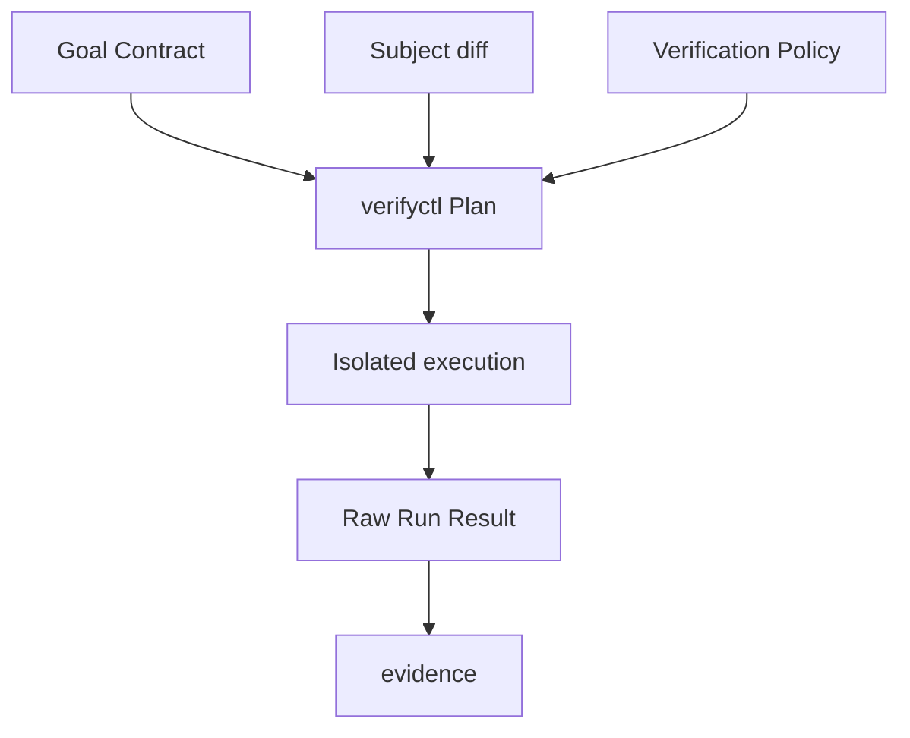

> **infra.rs 说明**：本文为控制面生产 Goal/Spec，落在 `.agents/ssot/tools/`。  
> 组件期望路径：`tools/{goalctl,verifyctl}`；**本仓尚未创建对应 crate**。  
> 对齐：[docs/ssot/tools-ssot-alignment.md](../../../../../docs/ssot/tools-ssot-alignment.md)

---

# verifyctl：生产级 Goal

> Goal ID：`GOAL-2026-VERIFYCTL-001`  
> 文档版本：1.0.0  
> 状态：Proposed  
> 风险等级：R3——错误漏检可使缺陷进入生产  
> 组件路径：`tools/verifyctl`  
> Parent Goal：`GOAL-2026-0001-vibe-coding-self-verification`  
> 配套 Spec：`verifyctl-spec.md`

---

## 0. 最终裁定

`verifyctl` 必须成为 infra.rs 唯一的验证规划与执行控制面：根据 Goal Contract、代码变更、架构关系、风险和验证策略，生成确定性的最小充分验证闭包，并以可重放方式执行。

它只回答两个问题：

1. 为反证当前变更，至少必须执行哪些检查？
2. 这些检查实际产生了什么原始结果？

它不定义 Goal，不把结果包装成受信 Evidence，不决定合并或发布，也不能因为“本地通过”自行授权。

## 1. 问题本质

Vibe Coding 的验证通常在两个失败极端间摆动：

- 每次运行全仓库验证，反馈过慢，开发者和 Agent 最终绕过它。
- 根据文件名猜测少跑测试，反馈很快，却静默漏掉跨包、构建脚本、Feature、协议和运行时影响。

生产级系统需要第三条路径：以显式依赖图和风险策略计算验证闭包；能证明安全时缩小范围，无法证明时自动升级，而不是乐观跳过。

## 2. 基本真理

1. “没有发现影响”不等于“没有影响”。
2. 最小验证集合必须由可审计规则推导，不能由 Agent 临场决定。
3. 风险升高只能增加或强化验证，不能减少验证。
4. 相同 Subject、Goal Contract、Policy 和工具版本必须生成相同 Plan。
5. Required Check 的缺失、超时、取消、未知或不可信都不等于通过。
6. 缓存只能复用相同 Build Key、输入摘要和足够 Trust 的结果。
7. 构建者不能把自己的结果声明为“独立验证”。
8. 变更影响无法解析时，正确行为是扩大验证闭包。
9. 验证输出是事实输入，不是授权结论。

## 3. 核心 Outcome

对于每个绑定 Goal Contract 的变更，`verifyctl` 在给定预算内：

- 计算包含直接影响、反向依赖、集成消费者、Feature、Target 和架构约束的验证闭包。
- 把每个 AC/INV 映射到至少一个可执行检查或明确的人工控制。
- 生成稳定、可解释、可哈希的验证 DAG。
- 编译去重：同一 Build Key 只产生一次构建。
- 在隔离环境中执行检查并记录命令、输入、输出、时长和退出状态。
- 对未知影响、策略冲突和不完整覆盖默认升级或失败。
- 输出可供 `evidence` 收集、但尚未被其赋予 Trust 的原始 Run Result。

## 4. 目标用户

| 用户 | 目标 |
|---|---|
| Builder Agent | 在编码循环中快速获得最小安全反馈 |
| Independent Verifier | 对实现执行独立反证与深度验证 |
| 开发者 | 解释为何某项检查运行、跳过或升级 |
| 架构师 | 将跨边界约束变为强制检查 |
| CI 平台 | 稳定调度、缓存和汇总验证任务 |
| `evidence` | 收集完整、结构化、不可歧义的 Run Result |
| 审计者 | 重放 Plan 并追踪每个 AC/INV 的覆盖 |

## 5. 范围

### 5.1 In Scope

- Git 变更解析，包括 rename、delete、submodule 和生成文件。
- Rust workspace、crate、target、feature、build dependency 和反向依赖分析。
- 架构图、协议消费者、集成边和组织级验证策略合并。
- 风险驱动的 Local、Fast、Depth、Release 验证 Profile。
- AC/INV/Constraint 到 Check 的覆盖闭包。
- 确定性 Plan、DAG 调度、隔离执行、超时、重试和取消。
- Build Key、Cache Key、编译去重和按 Trust 分区的缓存复用。
- 结构化日志、JUnit、覆盖率、制品摘要和 Run Result。
- Plan/Run 的解释、比较、重放和诊断。

### 5.2 Out of Scope

- Goal 的创建和语义编译；由 `goalctl` 负责。
- Evidence 的签名、发布、保留和 Trust 派生；由 `evidence` 负责。
- Merge/Release/Runtime 授权；由 `gate` 负责。
- GitHub Ruleset、部署平台或制品仓库的外部状态修改。
- 自动修改业务代码以“让测试通过”。
- 把 Flaky Check 静默重试成 Pass。
- 将外部服务的实时生产数据作为默认测试依赖。

## 6. 系统边界

`verifyctl` 可读取仓库、受控缓存和显式测试 Fixture；只有执行器可运行 Subject 代码。规划器不得联网，结果汇总器不得把运行状态升级为授权状态。

## 7. 核心概念

| 概念 | 定义 |
|---|---|
| Subject | 被验证的精确代码身份与源码树摘要 |
| Change Set | Base 与 Subject 之间规范化后的文件和语义变化 |
| Impact Closure | 直接影响及其反向依赖、消费者、Feature、Target 闭包 |
| Check | 单一职责、可执行、有声明输入输出的验证单元 |
| Profile | Local、Fast、Depth、Release 等预算与强度组合 |
| Plan | 在固定输入下生成的确定性验证 DAG |
| Run | 对某个 Plan 的一次执行实例 |
| Build Key | 决定可否共享编译产物的完整输入摘要 |
| Trust Requirement | 下游接受该结果所需的最低执行环境等级 |
| Coverage Closure | Goal 的所有 AC/INV 与 Check 的闭合映射 |

## 8. 风险模型

| 风险 | 典型变更 | 最低验证策略 |
|---|---|---|
| R0 | 文案、非执行文档 | 格式、链接、文档约束 |
| R1 | 局部实现、无公共契约 | 受影响 crate 单测、Lint、格式和编译 |
| R2 | 公共 API、跨 crate、配置、协议 | 反向依赖、集成、契约、Feature 矩阵 |
| R3 | 安全、权限、发布、数据、门禁、自验证组件 | 全 workspace、独立反证、Depth、发布前验证 |

以下任一变化必须至少升级到 R3 全量策略：

- 根 `Cargo.toml`、`Cargo.lock`、Rust toolchain 或 `.cargo/`。
- `build.rs`、过程宏、代码生成器或 Schema 生成链。
- `.agent/` 下 Goal、Verification、Evidence 或 Gate 控制面策略。
- 权限、密钥、供应链、发布、迁移、Gate 或 Evidence 代码。
- 影响解析失败、未知文件类型、依赖图不完整或策略冲突。

## 9. 不变量

| ID | 不变量 |
|---|---|
| `VCTL-INV-001` | 相同规范化输入必须生成字节级一致的 Plan。 |
| `VCTL-INV-002` | 未知影响必须升级验证，禁止静默跳过。 |
| `VCTL-INV-003` | 风险等级升高不得减少任何 Required Check。 |
| `VCTL-INV-004` | 每个 Required AC/INV 必须被至少一个满足 Trust 要求的 Check 覆盖。 |
| `VCTL-INV-005` | Required Check 的非 Pass 状态不得满足覆盖。 |
| `VCTL-INV-006` | 同一 Plan 中相同 Build Key 只能有一个产物生产者。 |
| `VCTL-INV-007` | 低 Trust 结果不得替代高 Trust 要求。 |
| `VCTL-INV-008` | Builder 生成的结果不得声明 independent origin。 |
| `VCTL-INV-009` | 任何缓存命中都必须验证完整 Cache Key、产物摘要和 Trust namespace。 |
| `VCTL-INV-010` | 重试历史必须保留；Flaky 不得被折叠为稳定 Pass。 |
| `VCTL-INV-011` | Plan/Run 必须精确绑定 Subject、Goal Contract 和 Policy digest。 |
| `VCTL-INV-012` | 验证执行不得修改仓库受版本控制文件。 |
| `VCTL-INV-013` | 取消、超时、基础设施错误和未运行必须彼此区分。 |
| `VCTL-INV-014` | 规划和汇总阶段不得执行不受信 Subject 代码。 |

## 10. 生产场景

### 10.1 本地编码循环

Agent 执行 Local Profile。系统在 90 秒目标内运行局部编译、单测和静态检查；结果仅为 `developer-local`，不能替代受保护分支需要的 CI Evidence。

### 10.2 Pull Request Fast Gate

CI 对 PR head 计算 Fast Plan，执行所有 R0–R2 必需检查及 R3 的安全快速子集，P95 在 300 秒内完成。PR 代码运行在无写权限、无 OIDC 的非特权 Job。

### 10.3 Merge Queue

对 `merge_group` synthetic SHA 重新计算影响和执行 Fast Plan，禁止复用只绑定 PR head 的结果。

### 10.4 独立 Depth 验证

Independent Verifier 使用隔离身份对同一 Subject 运行反例、属性、变异、跨 Feature 和集成检查，目标 60 分钟内完成。

### 10.5 Release 验证

针对将发布的不可变 Commit/Artifact 运行 Release Profile；任何源码、依赖、编译器或构建参数差异都会生成新 Build Key。

## 11. 成功指标

| 指标 | 生产目标 |
|---|---|
| Fast Gate P95 | `≤ 300s` |
| Local Profile P95 | `≤ 90s` |
| Depth Profile P95 | `≤ 60min` |
| Required AC/INV 覆盖率 | `100%` |
| 未知影响静默跳过 | `0` |
| 相同 Build Key 重复编译 | `0` |
| 缓存跨 Trust 越权命中 | `0` |
| 确定性 Plan 差异 | `0` |
| 稳定检查 Flaky 率 | `< 0.5%` |
| Run Result 可重放率 | `100%`（受可用 Fixture 约束） |

## 12. Goal 验收条件

| ID | 验收条件 |
|---|---|
| `VCTL-GOAL-AC-001` | 任一绑定 Goal 的变更都能生成唯一 Plan ID 和 Plan digest。 |
| `VCTL-GOAL-AC-002` | 相同输入跨两次运行生成字节一致的 Plan。 |
| `VCTL-GOAL-AC-003` | Plan 明确记录 Subject、Base、Goal Contract 和 Policy digest。 |
| `VCTL-GOAL-AC-004` | rename 同时按旧路径和新路径计算影响。 |
| `VCTL-GOAL-AC-005` | 删除公共模块仍会触发其反向依赖验证。 |
| `VCTL-GOAL-AC-006` | workspace 根清单、锁文件或 toolchain 变化触发全量验证。 |
| `VCTL-GOAL-AC-007` | `build.rs`、过程宏或代码生成链变化触发所有消费者验证。 |
| `VCTL-GOAL-AC-008` | 未知文件或无法解析的依赖边不会产生缩小后的 Plan。 |
| `VCTL-GOAL-AC-009` | 所有 Required AC/INV 均出现在 Coverage Closure 中。 |
| `VCTL-GOAL-AC-010` | 缺少 Check 映射时规划失败并列出缺口。 |
| `VCTL-GOAL-AC-011` | 风险从 R1 升到 R3 后 Required Check 集合只增不减。 |
| `VCTL-GOAL-AC-012` | 同一 Build Key 在一个 Plan 中仅编译一次。 |
| `VCTL-GOAL-AC-013` | Cache Key 任一材料变化都会导致缓存失效。 |
| `VCTL-GOAL-AC-014` | `developer-local` 缓存不能满足 `ci-trusted` 要求。 |
| `VCTL-GOAL-AC-015` | Required Check 超时、取消、跳过或基础设施失败时整体不为 Pass。 |
| `VCTL-GOAL-AC-016` | 重试后通过的检查仍暴露完整尝试历史和 flaky 标记。 |
| `VCTL-GOAL-AC-017` | Builder 与 Independent Verifier 的来源身份不可互相伪装。 |
| `VCTL-GOAL-AC-018` | 执行器检测到版本控制文件变更时 Run 失败。 |
| `VCTL-GOAL-AC-019` | 每个 Check 记录规范化命令、环境白名单、输入和输出摘要。 |
| `VCTL-GOAL-AC-020` | 每个 Plan 都能解释某 Check 为什么运行、为什么未选择。 |
| `VCTL-GOAL-AC-021` | PR head 结果不会被错误复用于 merge queue synthetic SHA。 |
| `VCTL-GOAL-AC-022` | Fast、Depth 和 Release Profile 使用同一 Check 定义而非复制脚本语义。 |
| `VCTL-GOAL-AC-023` | 非特权执行 Job 不持有发布凭据或 OIDC 写权限。 |
| `VCTL-GOAL-AC-024` | 规划器与汇总器测试证明不会执行 Subject 代码。 |
| `VCTL-GOAL-AC-025` | Fast Gate 在基准仓库达到 P95 `≤ 300s`。 |
| `VCTL-GOAL-AC-026` | Local Profile 在基准增量变更达到 P95 `≤ 90s`。 |
| `VCTL-GOAL-AC-027` | Depth Profile 在生产标准 runner 达到 P95 `≤ 60min`。 |
| `VCTL-GOAL-AC-028` | JSON 输出向后兼容并通过 Schema 验证。 |
| `VCTL-GOAL-AC-029` | Linux CI 中连续 100 次同输入规划无非确定性差异。 |
| `VCTL-GOAL-AC-030` | 失败 Run 可使用保存的 Plan、材料和 Fixture 在隔离环境重放。 |

## 13. 最小可行闭环（MVA）

首个可上线版本必须同时具备：

1. Rust workspace 影响闭包与保守升级。
2. Goal AC/INV 覆盖闭包。
3. Local、Fast、Depth 三类 Profile。
4. 确定性 DAG、编译去重和隔离执行。
5. 完整 Run Result、日志和产物摘要。
6. Trust 分区缓存，不允许跨级替代。
7. `plan`、`run`、`explain`、`replay`、`doctor` CLI。

缺少任一项，都只能作为实验工具，不能接入生产 Gate。

## 14. 分阶段 Outcome

### 第 1 天：契约闭合

- 固化 Plan、Run、Check Schema。
- 建立全量升级规则和覆盖缺口失败规则。
- 用 10 个真实变更样本验证影响模型。

### 第 7 天：Fast Gate 可用

- 完成 Rust 依赖闭包、DAG、执行隔离和结构化结果。
- CI 接入 PR 与 `merge_group`。
- 达成 Fast P95 预算并消除重复构建。

### 第 30 天：生产可信

- 完成独立 Depth、缓存 Trust 分区、重放和故障演练。
- 引入属性、变异、契约与供应链检查。
- 用历史事故回放验证零静默漏检。

## 15. Definition of Done

`verifyctl` 只有在以下条件全部成立时才可标记为生产就绪：

- `VCTL-INV-001` 至 `VCTL-INV-014` 均有自动化守护。
- `VCTL-GOAL-AC-001` 至 `VCTL-GOAL-AC-030` 均有可追踪 Evidence。
- R3 变更完成独立安全评审、威胁建模和故障注入。
- 基准、可靠性、缓存污染和非确定性测试全部达标。
- `evidence` 能无歧义消费 Run Result。
- `gate` 只依据受信 Evidence 判断，不直接解释 `verifyctl` 日志。
- 运维 Runbook、回滚策略、Schema 迁移和兼容窗口已批准。

## 16. 最终路径

本 Goal 的生产实现必须遵循：

> 显式 Goal 覆盖 → 保守影响闭包 → 确定性验证 DAG → 隔离执行 → 原始 Run Result → Evidence → Gate。

任何“AI 判断没必要测试”“缓存看起来可用”或“重试过了就算稳定”的捷径，均违反本 Goal。
